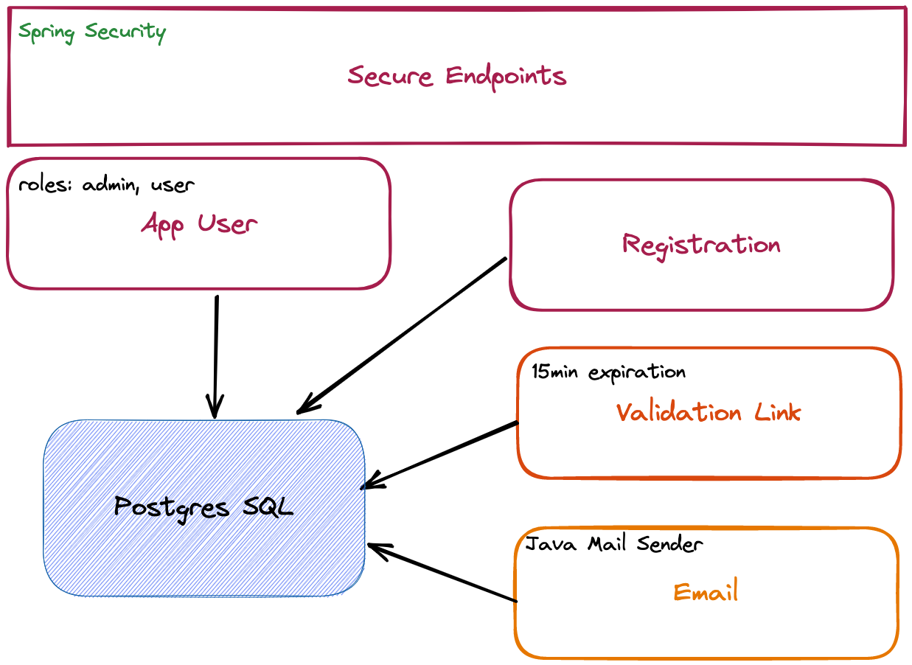

# spring-security-email-validation

to learn spring security email validation

## 구상도



## PostgreSQL Container Run

```bash
docker pull postgres

docker run \
    --name registrationDB \
    -p 5433:5432 \
    -e POSTGRES_USER=admin \
    -e POSTGRES_PASSWORD=pwd \
    -e POSTGRES_DB=registration \
    -d \
    postgres
```

### Inspect Database

```bash
docker exec -it <PSQL-Container-ID> bash
#           호스트     |  포트 |  유저  |  DB     
$ psql -h localhost -p 5432 -U admin registration -W # to authenticate to start using as postgres user
```
